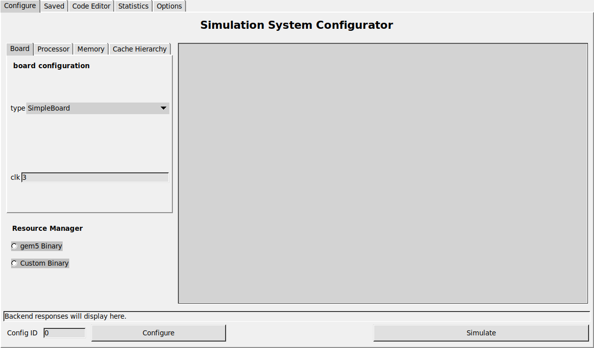
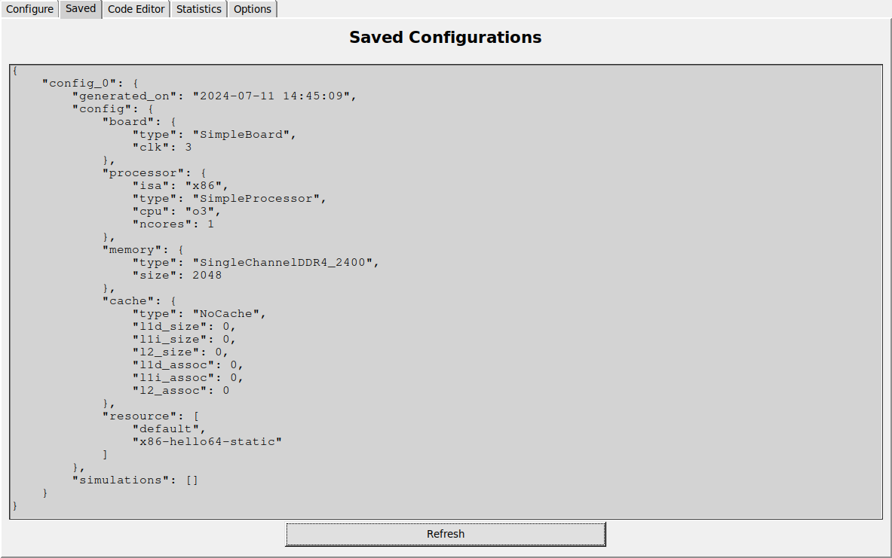
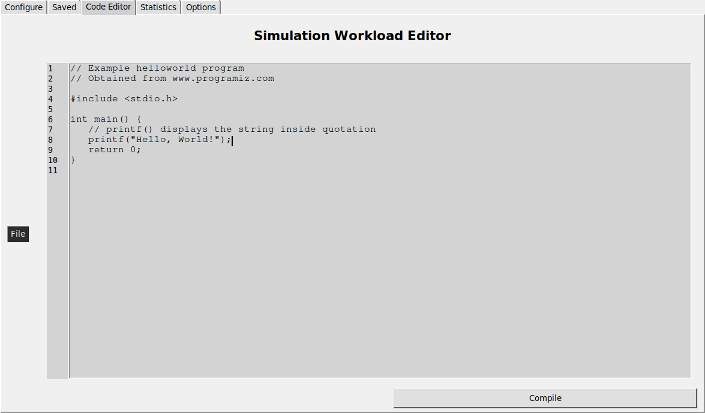
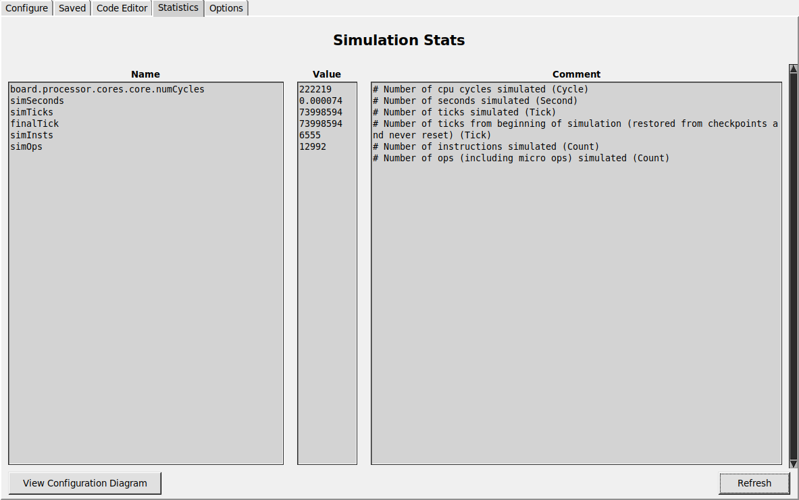
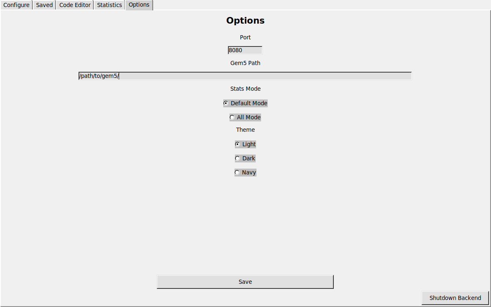

# SimScholar v1.1.2
**SimScholar is a computer architecture learning tool utilizing gem5**
- This project would not be possible without [gem5](https://github.com/gem5/gem5).
- The GUI utilizes the GEMA backend - See [gema](https://github.com/amanley97/gEMA)

### Prerequisites:
#### Libraries and Python Packages:
  - gcc
  - python3
  - colorama
  - requests
  - Pillow
  - pydot

### Features:
#### gem5 Configuration:
  
  - gem5 simulations in SE mode
  - Simple boards
  - CPU types: atomic, timing, O3, minor
  - ISAs: x86 and ARM
  - All stdlib memory types
  - All stdlib cache types
  
  - view saved configurations

#### User Programs:
  
  - Open, save, compile C programs
  - Currently x86 architecture only.
  - Load as resource for gem5

#### Stats:
  
  - View simulation statistics
  - Default parses most important stats
  - Option to enable all stats

#### Option Menu:
  
  - Modify SimScholar options
